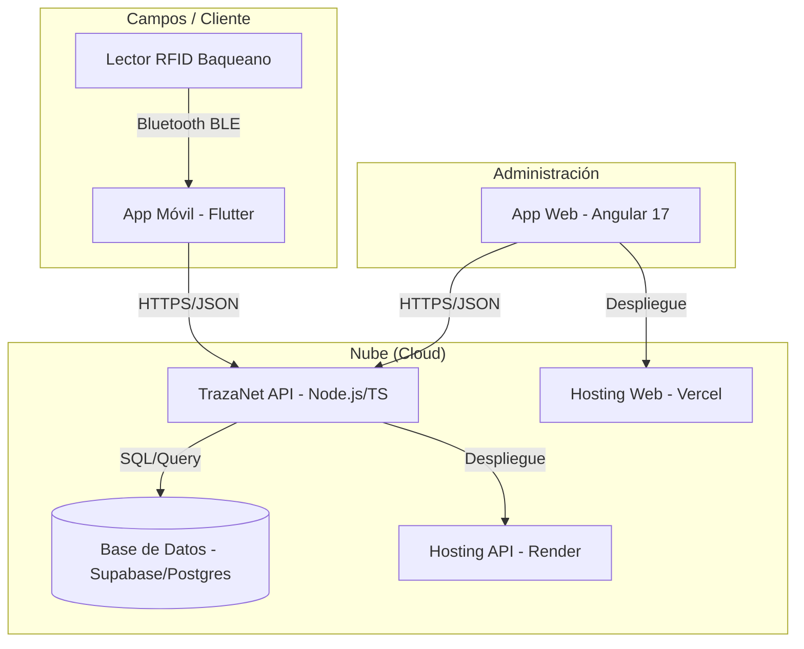

# Arquitectura General de TrazaNet

Este documento detalla la estructura técnica y el flujo de datos del ecosistema TrazaNet.

## 🏗️ Diagrama de Componentes

## 🔄 Flujo de Datos

1.  **Captura de Datos**: El usuario utiliza el Lector RFID para escanear la caravana de un animal.
2.  **Transmisión Local**: La información se envía vía Bluetooth (BLE) a la App Móvil.
3.  **Procesamiento y Sincronización**:
    *   La App Móvil recibe el código de la caravana.
    *   Envía un `POST` a `/api/lecturas` con el código y el `loteId`.
    *   La API registra la lectura en Supabase.
4.  **Visualización**: El administrador puede ver los datos actualizados inmediatamente en la App Web o en las pestañas de Lotes/Animales de la App Móvil.

## 🔒 Seguridad y Autenticación

*   **API**: Protegida mediante Helmet y políticas de CORS estrictas.
*   **Base de Datos**: Utiliza las llaves de acceso de Supabase (Anon Key / Service Role) gestionadas por la API.
*   **Comunicaciones**: Todas las peticiones se realizan sobre HTTPS.

## 🌐 Servicios Externos

*   **Supabase**: Gestión de base de datos relacional y autenticación (futura).
*   **Render**: Hosting escalable para el backend.
*   **Vercel**: Hosting optimizado para la aplicación Angular.
*   **Codemagic**: Automatización de builds para iOS.

---
Arquitectura TrazaNet v1.0
