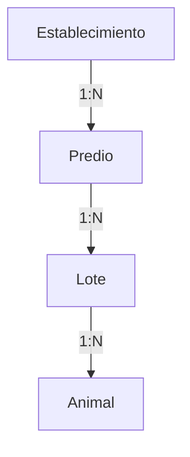

# Modelo de Dominio: Predios

## Introducción

En la ganadería de precisión, la ubicación no es solo un texto ("Potrero del fondo"), sino una entidad física con propiedades medibles. Un **Predio** representa una subdivisión física de tierra (potrero, parcela, cuadro) dentro de un Establecimiento.

## Relación Jerárquica

1. **Establecimiento**: La unidad de negocio mayor (ej. "Estancia La Paz"). Tiene un DICOSE.
2. **Predio**: La subdivisión física (alambrados). Tiene superficie (ha) y un nombre/código fijo.
3. **Lote**: Un grupo lógico de animales que ocupan un predio en un momento dado. El Lote es dinámico (se crea, se mueve, se vende), el Predio es estático.

## Estructura de Datos

### Tabla `predios`

| Campo | Tipo | Descripción |
|-------|------|-------------|
| `id` | UUID | Identificador único |
| `establecimiento_id` | UUID | FK a Establecimientos |
| `nombre` | String | Nombre coloquial (ej. "Bajo del Molino") |
| `codigo` | String | Código interno (ej. "P-04") |
| `superficie_ha` | Decimal | Área en hectáreas (útil para calcular carga animal) |
| `descripcion` | Text | Detalles adicionales (ej. "Pastura implantada 2024") |

## Casos de Uso

* **Rotación**: Al mover un Lote, se actualiza su `predio_id`.
* **Carga Animal**: `Sum(peso animales en lote) / predio.superficie_ha`.
* **Historial**: Se puede trazar qué lotes han pasado por un predio específico a lo largo del tiempo (para manejo de pasturas).

## Implementación

* **Offline**: Los predios se descargan al dispositivo y se pueden crear nuevos offline. Al sincronizar, se consolidan en el servidor.
* **Migración**: Los sistemas anteriores que usaban campo de texto "ubicación" en Lotes han sido migrados automáticamente, creando Predios con esos nombres.
